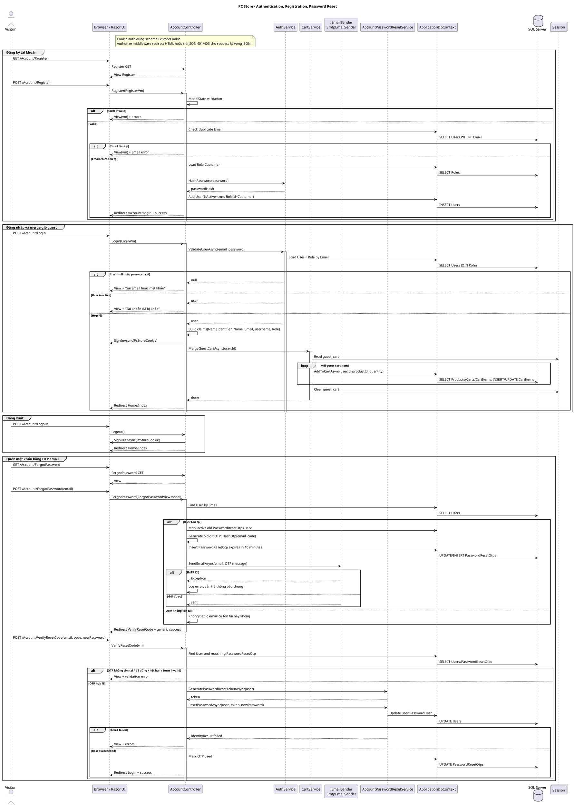
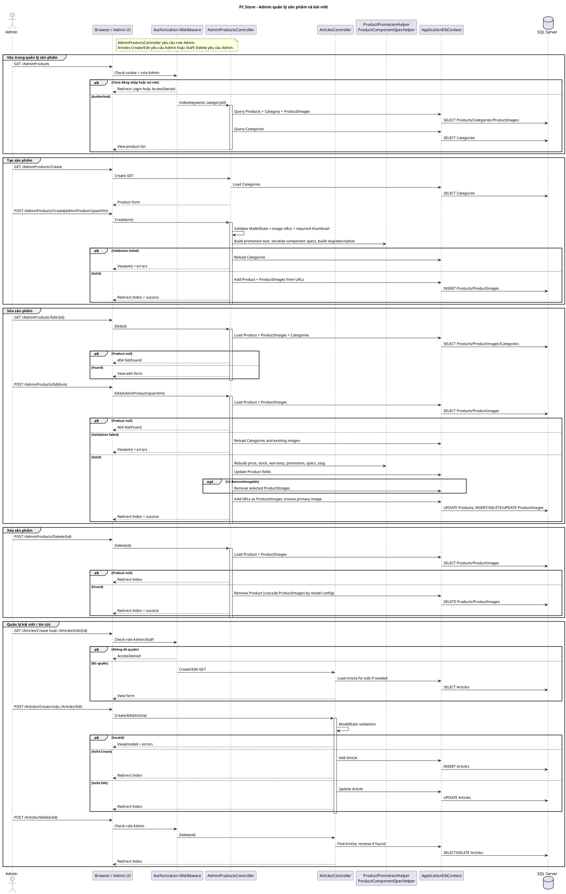
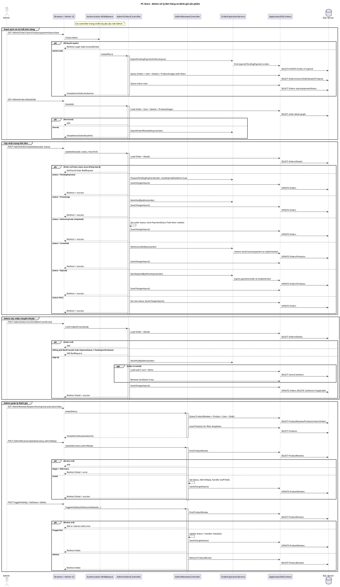

# Sơ đồ tuần tự PlantUML - PC Store

Tài liệu này được lập sau khi rà soát controller, service, DbContext, model, view và cấu hình khởi động của dự án ASP.NET Core MVC PC Store.

## Tóm tắt logic hệ thống

- Ứng dụng là ASP.NET Core MVC, render giao diện bằng Razor Views, định tuyến mặc định `{controller=Home}/{action=Index}/{id?}` và dùng Cookie Authentication với scheme `PcStoreCookie`.
- `ApplicationDbContext` là lớp truy cập dữ liệu chính; chưa có repository riêng. Controller gọi trực tiếp `ApplicationDbContext` hoặc đi qua service như `CartService`, `AuthService`, `ShippingService`, `OrderExpirationService`, `ProductReviewService`.
- Catalog gồm `Products`, `Categories`, `ProductImages`, `Banners`, `Articles`, `SiteSettings`.
- Giỏ hàng có hai nhánh: khách vãng lai lưu trong session key `guest_cart`; người dùng đăng nhập lưu bảng `Carts`/`CartItems`.
- Checkout tạo `Orders` và `OrderDetails` trong transaction, kiểm tra tồn kho, trừ tồn kho sản phẩm, lưu địa chỉ/phí ship/phương thức thanh toán.
- Hệ thống chỉ có hai phương thức thanh toán đang được dùng trong checkout: COD và chuyển khoản ngân hàng. Chuyển khoản tạo đơn `PendingPayment`, có hạn thanh toán và trang `BankTransfer`; khách xác nhận đã chuyển khoản, admin xác nhận thanh toán.
- Admin dùng `[Authorize(Roles = "Admin")]` cho quản lý sản phẩm, đơn hàng, danh mục, banner, người dùng, cài đặt, bảo hành, review. Bài viết cho phép `Admin,Staff` tạo/sửa và chỉ `Admin` xóa.

## Luồng nghiệp vụ tìm thấy

1. Khách hàng xem trang chủ, danh sách sản phẩm, chi tiết sản phẩm và đánh giá.
2. Khách hàng thêm/cập nhật/xóa/xóa toàn bộ giỏ hàng; có phân nhánh guest session và user DB cart.
3. Đăng ký, đăng nhập, đăng xuất, cập nhật hồ sơ, đổi mật khẩu, quên mật khẩu bằng OTP email.
4. Checkout, tính phí ship, tạo đơn COD hoặc chuyển khoản, theo dõi đơn, tra cứu đơn guest, xem đơn của tôi.
5. Admin quản lý đơn hàng, cập nhật trạng thái, xác nhận chuyển khoản.
6. Admin quản lý sản phẩm: danh sách, tạo, sửa, xóa, ảnh sản phẩm, trạng thái tồn kho.
7. Bài viết/tin tức: public xem danh sách/chi tiết; Admin/Staff tạo/sửa; Admin xóa.
8. Đánh giá sản phẩm: user đã đăng nhập đánh giá sản phẩm thuộc đơn hoàn thành; admin duyệt/ẩn/trả lời/xóa.
9. Bảo hành, hỗ trợ chat, build PC, so sánh sản phẩm có controller/service riêng; không đưa hết vào sơ đồ tổng thể để tránh quá rối.

## Sơ đồ 1 - Khách hàng duyệt sản phẩm, giỏ hàng, checkout, thanh toán

```plantuml
@startuml
title PC Store - Khách hàng duyệt sản phẩm, giỏ hàng, checkout và thanh toán

actor Customer as C
participant "Browser / Razor UI" as UI
participant "ProductsController" as Products
participant "CartController" as CartCtrl
participant "OrdersController" as Orders
participant "ShippingController\n/api/shipping" as ShipApi
participant "CartService" as CartSvc
participant "ShippingService" as ShipSvc
participant "OrderExpirationService" as ExpSvc
participant "ProductReviewService" as ReviewSvc
participant "GHN services\n(optional external)" as GHN
participant "ApplicationDbContext" as DbCtx
database "SQL Server" as DB
collections "Session" as Session

note over DbCtx
Dự án không có repository riêng.
Controller/service truy cập DB qua ApplicationDbContext + EF Core.
end note

group Xem danh sách sản phẩm
C -> UI: GET /Products?filter...
UI -> Products: Index(keyword, categoryId, brand, price, facets)
activate Products
Products -> DbCtx: Query Products + Category
DbCtx -> DB: SELECT Products/Categories
DB --> DbCtx: product candidates
DbCtx --> Products: entities
Products -> Products: Apply keyword, price, brand, CPU/RAM/GPU facet filters
Products -> DbCtx: Query Categories for filter sidebar
DbCtx -> DB: SELECT Categories
DB --> DbCtx: categories
Products --> UI: View(ProductFilterVm)
deactivate Products
UI --> C: Hiển thị danh sách + bộ lọc
end

group Xem chi tiết sản phẩm và review
C -> UI: GET /Products/Detail/{id}
UI -> Products: Detail(id, rating?)
activate Products
Products -> DbCtx: Load Product + Category + ProductImages
DbCtx -> DB: SELECT product detail
DB --> DbCtx: product
alt Không tìm thấy sản phẩm
Products --> UI: 404 NotFound
else Tìm thấy sản phẩm
Products -> DbCtx: Load upgrade suggestions same category, higher price
DbCtx -> DB: SELECT suggested products
Products -> ReviewSvc: GetSectionAsync(productId, userId?, rating?)
activate ReviewSvc
ReviewSvc -> DbCtx: Query approved reviews + eligibility metadata
DbCtx -> DB: SELECT ProductReviews/Orders as needed
DB --> DbCtx: review data
ReviewSvc --> Products: ProductReviewSectionVm
deactivate ReviewSvc
Products --> UI: View(Product)
end
deactivate Products
UI --> C: Hiển thị chi tiết, gợi ý nâng cấp, đánh giá
end

group Thêm sản phẩm vào giỏ hàng
C -> UI: POST /Cart/Add(productId, quantity)
UI -> CartCtrl: Add(productId, quantity)
activate CartCtrl
CartCtrl -> CartSvc: AddToCartAsync(userId?, productId, quantity)
activate CartSvc
CartSvc -> DbCtx: Find active product
DbCtx -> DB: SELECT Product WHERE IsActive
DB --> DbCtx: product/null
alt Product null hoặc thiếu tồn kho
CartSvc --> CartCtrl: (Ok=false, Error)
CartCtrl --> UI: Redirect back + TempData error
else User đã đăng nhập
CartSvc -> DbCtx: GetOrCreate Cart(UserId)
DbCtx -> DB: SELECT/INSERT Cart
CartSvc -> DbCtx: Find or add CartItem; clamp quantity <= stock
DbCtx -> DB: SELECT/INSERT/UPDATE CartItems
CartSvc -> DbCtx: SaveChangesAsync()
DbCtx -> DB: COMMIT
CartSvc --> CartCtrl: (Ok=true)
CartCtrl --> UI: Redirect /Cart
else Guest chưa đăng nhập
CartSvc -> Session: Read guest_cart
CartSvc -> Session: Add/update line with CartItemId = -productId
CartSvc --> CartCtrl: (Ok=true)
CartCtrl --> UI: Redirect /Cart
end
deactivate CartSvc
deactivate CartCtrl
UI --> C: Cập nhật giỏ hàng
end

group Cập nhật hoặc xóa giỏ hàng
C -> UI: POST /Cart/Update hoặc /Cart/Remove hoặc /Cart/Clear
UI -> CartCtrl: Update/Remove/Clear(cartItemId, quantity?)
activate CartCtrl
CartCtrl -> CartSvc: UpdateQuantityAsync / RemoveItemAsync / ClearCartAsync
activate CartSvc
alt User đã đăng nhập
CartSvc -> DbCtx: Load Cart + CartItems; validate owner and stock
DbCtx -> DB: SELECT/UPDATE/DELETE CartItems
CartSvc -> DbCtx: SaveChangesAsync()
DbCtx -> DB: COMMIT
else Guest
CartSvc -> Session: Read/write guest_cart
end
CartSvc --> CartCtrl: success or validation error
CartCtrl --> UI: Redirect /Cart
deactivate CartSvc
deactivate CartCtrl
UI --> C: Hiển thị giỏ mới
end

group Tính phí giao hàng tại checkout
C -> UI: GET /Checkout
UI -> Orders: Checkout GET
activate Orders
opt User đã đăng nhập
Orders -> DbCtx: Load User để điền tên/email/phone
DbCtx -> DB: SELECT Users
end
Orders -> CartSvc: GetCartAsync(userId?)
CartSvc -> DbCtx: Load DB cart if authenticated
CartSvc -> Session: Load session cart if guest
Orders --> UI: View(CheckoutRequestVm + ViewBag.Cart)
deactivate Orders

C -> UI: Chọn địa chỉ, bấm tính phí
UI -> ShipApi: POST /api/shipping/calculate
activate ShipApi
ShipApi -> CartSvc: GetCartAsync(null)
note right of ShipApi
Code hiện tính phí ship dựa trên guest cart (userId null),
kể cả checkout của user đã đăng nhập.
end note
ShipApi -> ShipSvc: CalculateAsync(address, weight/dimensions)
activate ShipSvc
ShipSvc -> DbCtx: Load active ShippingConfig
DbCtx -> DB: SELECT ShippingConfigs
alt Cùng khu vực shop theo policy
ShipSvc --> ShipApi: ShippingQuote free LocalFreeRadius
else Ngoài khu vực và bật GHN
ShipSvc -> GHN: CalculateFeeAsync(...)
alt GHN success
GHN --> ShipSvc: fee/leadtime
ShipSvc --> ShipApi: ShippingQuote provider=GHN
else GHN fail hoặc tắt GHN
ShipSvc -> ShipSvc: LocalFormulaFallback
ShipSvc --> ShipApi: ShippingQuote fallback
end
end
deactivate ShipSvc
ShipApi --> UI: JSON success/fail + shippingFee/provider/formula
deactivate ShipApi
UI --> C: Cập nhật phí ship vào form
end

group Đặt hàng
C -> UI: POST /Checkout
UI -> Orders: Checkout POST(CheckoutRequestVm)
activate Orders
Orders -> Orders: Validate name, phone, email, address, shipping fee, payment method
Orders -> CartSvc: GetCartAsync(userId?)
CartSvc -> DbCtx: Load cart from DB if user
CartSvc -> Session: Load cart from session if guest
alt Model invalid hoặc giỏ trống
Orders --> UI: View checkout + errors
else Valid
Orders -> DbCtx: BeginTransactionAsync()
DbCtx -> DB: BEGIN TRANSACTION
loop Mỗi item trong giỏ
Orders -> DbCtx: Load active Product and check stock
DbCtx -> DB: SELECT Products
Orders -> Orders: Build OrderDetail and subtotal
end
alt Chuyển khoản ngân hàng và đã có đơn PendingPayment chưa hết hạn
Orders -> ExpSvc: ExpireOrderIfNeededAsync(existingPending)
ExpSvc -> DbCtx: update if expired
Orders --> UI: Redirect /Orders/BankTransfer/{existingId}
else Tạo đơn mới
Orders -> DbCtx: Add Order + Details
loop Mỗi item
Orders -> DbCtx: Decrease Product.StockQuantity; set IsInStock
end
DbCtx -> DB: INSERT Orders/OrderDetails; UPDATE Products
alt PaymentMethod = BankTransfer
Orders -> DbCtx: Save order, set TransferContent = DH{id}
Orders -> Session: Set LastPendingPaymentOrderId, LastOrderId
note right of Orders
Code không xóa giỏ ngay khi tạo đơn chuyển khoản.
Giỏ được xóa khi admin xác nhận chuyển khoản cho user đã đăng nhập.
end note
Orders -> DbCtx: Commit transaction
Orders --> UI: Redirect /Orders/BankTransfer/{id}
else PaymentMethod = COD
Orders -> CartSvc: ClearCartAsync(userId?)
CartSvc -> DbCtx: Delete CartItems if user
CartSvc -> Session: Clear guest_cart if guest
Orders -> DbCtx: Commit transaction
Orders --> UI: Redirect /Orders/Success/{id}
end
end
end
deactivate Orders
UI --> C: Hiển thị thành công hoặc trang chuyển khoản
end

group Thanh toán chuyển khoản và theo dõi đơn
C -> UI: GET /Orders/BankTransfer/{id}
UI -> Orders: BankTransfer(id)
activate Orders
Orders -> DbCtx: Load Order + Details
DbCtx -> DB: SELECT Orders/Details
Orders -> Orders: CanAccessOrderTracking(order)
alt Không có quyền
Orders --> UI: 403 Forbidden
else Có quyền
Orders -> ExpSvc: ExpireOrderIfNeededAsync(order)
alt Hết hạn thanh toán
Orders --> UI: Redirect /Checkout + error
else Còn hạn
Orders --> UI: View bank transfer + remaining seconds
end
end
deactivate Orders

C -> UI: POST /Orders/ConfirmTransferred/{id}
UI -> Orders: ConfirmTransferred(id)
activate Orders
Orders -> DbCtx: Load Order
Orders -> Orders: Validate access, BankTransfer, not expired
alt Hợp lệ
Orders -> ExpSvc: MarkPaymentConfirmedByCustomer(order)
Orders -> DbCtx: SaveChangesAsync()
DbCtx -> DB: UPDATE Orders PaymentStatus=PendingConfirmation
Orders --> UI: Redirect /Order/Tracking/{id}
else Không hợp lệ
Orders --> UI: BadRequest/Forbidden/Redirect with error
end
deactivate Orders
end
@enduml
```

## Sơ đồ 2 - Đăng ký, đăng nhập, quên mật khẩu

## Sơ đồ 3 - Admin quản lý sản phẩm và bài viết

## Sơ đồ 4 - Admin xử lý đơn hàng và đánh giá

## Điểm nghi ngờ / chưa chắc chắn khi đọc code

- Không thấy repository layer riêng; sơ đồ dùng `ApplicationDbContext` thay cho repository.
- `ShippingController.Calculate` gọi `_cartService.GetCartAsync(null)`, tức luôn lấy giỏ session/guest để tính kích thước cân nặng, chưa truyền user id đăng nhập.
- Checkout chuyển khoản tạo đơn và trừ tồn kho nhưng không xóa giỏ ngay; code chỉ xóa giỏ user trong `AdminOrdersController.ConfirmBankTransfer`. Guest cart chuyển khoản không có bước xóa rõ ràng tại thời điểm tạo đơn.
- Có trường `PaymentUrl` và các cột payment gateway trong migration, nhưng checkout hiện chỉ chấp nhận `COD` và `BankTransfer`; không vẽ cổng thanh toán online như luồng đang tồn tại.
- Có các module Build PC, Warranty, Support Chat, Compare, Contact, Banner, Category, User, Settings; đã rà soát ở mức xác định luồng, nhưng không đưa đầy đủ vào sơ đồ chính để tránh quá tải.
